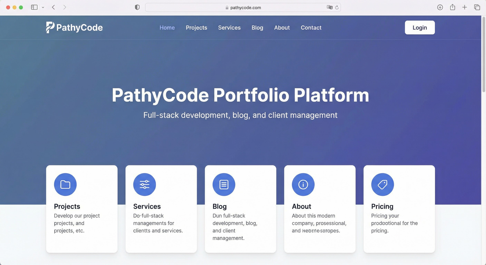

# PathyCode Portfolio Platform

A comprehensive full-stack web application built with Django REST Framework and React for managing a digital portfolio, blog, services, client quotes, and more.



## Features

- **Project Portfolio**: Showcase projects with images, descriptions, and technologies
- **Blog System**: Create and manage blog posts with categories and tags
- **Services Catalog**: Display services with pricing and features
- **Quote Requests**: Authenticated users can request project quotes
- **Contact Management**: Handle client inquiries and messages
- **Testimonials**: Display customer testimonials
- **Admin Panel**: Comprehensive admin interface for content management
- **User Authentication**: JWT-based authentication with role-based access control

## Technology Stack

### Backend
- Django 5.2.3
- Django REST Framework
- JWT Authentication (django-rest-framework-simplejwt)
- SQLite (development) / PostgreSQL (production-ready)

### Frontend
- React 18
- React Router v6
- Axios
- Tailwind CSS
- Context API for state management

## Quick Start

### Prerequisites
- Python 3.8+
- Node.js 14+
- pip
- npm

### Backend Setup

1. **Clone the repository**
```bash
git clone <repository-url>
cd glowing-memory
```

2. **Create and activate virtual environment**
```bash
python -m venv venv
# Windows
venv\Scripts\activate
# Linux/Mac
source venv/bin/activate
```

3. **Install dependencies**
```bash
pip install -r requirements.txt
```

4. **Run migrations**
```bash
python manage.py migrate
```

5. **Create superuser** (optional, for admin access)
```bash
python manage.py createsuperuser
```

6. **Run development server**
```bash
python manage.py runserver
```

The backend API will be available at `http://localhost:8000`

### Frontend Setup

1. **Navigate to frontend directory**
```bash
cd frontend
```

2. **Install dependencies**
```bash
npm install
```

3. **Run development server**
```bash
npm start
```

The frontend will be available at `http://localhost:3000`

## Project Structure

```
glowing-memory/
├── PathyCodeback/          # Django project root
│   ├── settings.py         # Django configuration
│   └── urls.py            # Root URL routing
├── users/                  # User authentication app
├── projects/               # Project portfolio app
├── blog/                   # Blog posts app
├── services/               # Services catalog app
├── quotes/                 # Quote requests app
├── invoices/               # Invoice management app
├── contact/                # Contact messages app
├── testimonials/           # Testimonials app
├── newsletter/             # Newsletter subscriptions
├── about/                  # About page content
├── frontend/               # React frontend
│   ├── src/
│   │   ├── components/     # Reusable components
│   │   ├── pages/          # Page components
│   │   ├── contexts/       # React Context providers
│   │   └── services/       # API services
│   └── public/
├── media/                  # User-uploaded files
└── docs/                   # Documentation
```

## Key Documentation

- **[User and Client Guide](docs/USER_AND_CLIENT_GUIDE.md)**: Difference between User and Client, how they are linked, Client Portal data flow, and why this architecture is used (start here for portal/auth work)
- **[Architecture Guide](docs/ARCHITECTURE.md)**: Complete system architecture and data flow
- **[Authentication Guide](docs/AUTHENTICATION.md)**: Authentication flow and security
- **[Quotes Workflow](docs/QUOTES_WORKFLOW.md)**: Quote request and management process
- **[Client Projects Workflow](CLIENT_PROJECTS_WORKFLOW.md)**: End-to-end business workflow (quotes → invoices → projects) and portal steps
- **[Public, Client Portal, and Admin Access](docs/PUBLIC_CLIENT_ADMIN_ACCESS.md)**: Which pages and APIs are public, which require login (Client Portal), and which require superuser (Admin)

## API Endpoints

### Authentication
- `POST /api/users/register/` - User registration
- `POST /api/users/login/` - User login
- `POST /api/users/token/refresh/` - Refresh JWT token
- `GET /api/users/profile/` - Get current user profile

### Projects
- `GET /api/projects/` - List all projects (public)
- `GET /api/projects/{id}/` - Get project details (public)
- `POST /api/projects/` - Create project (authenticated)
- `PUT/PATCH /api/projects/{id}/` - Update project (authenticated)
- `DELETE /api/projects/{id}/` - Delete project (authenticated)

### Quotes
- `POST /api/quotes/` - Submit quote request (authenticated)

See [Architecture Documentation](docs/ARCHITECTURE.md) for complete API reference.

## Access Control

### Public Access
- Home, About, Blog, Projects (view), Services, Contact pages

### Authenticated Users
- Profile (main hub), Client Portal, My Projects, Quotes (submit requests)
- **Note:** There is no separate User Dashboard; the Profile page (`/profile`) is the main hub after login.

### Superusers/Admins
- All authenticated user access
- Admin Panel (`/admin/*`)
- Full CRUD access to all models

See [Architecture & Access Guide](docs/ARCHITECTURE_AND_ACCESS.md) for data visibility rules and authentication flow.

## Media Files

Project images and other media files are stored in the `media/` directory. In development, Django serves these files directly. In production, configure your web server (nginx/Apache) to serve media files for better performance.

See [Architecture Documentation](docs/ARCHITECTURE.md#media-handling) for detailed media handling information.

## Environment Variables

Create a `.env` file in the root directory:

```env
SECRET_KEY=your-secret-key-here
DEBUG=True
ALLOWED_HOSTS=localhost,127.0.0.1
DB_ENGINE=django.db.backends.sqlite3
DB_NAME=db.sqlite3
```

See `PathyCodeback/settings.py` for all configurable settings.

## Development

### Running Tests
```bash
python manage.py test
```

### Creating Migrations
```bash
python manage.py makemigrations
python manage.py migrate
```

### Collecting Static Files
```bash
python manage.py collectstatic
```

## Deployment

See [Architecture Documentation - Deployment Notes](docs/ARCHITECTURE.md#deployment-notes) for production deployment checklist and recommendations.

### Production Checklist
- [ ] Set `DEBUG = False`
- [ ] Configure `ALLOWED_HOSTS`
- [ ] Use PostgreSQL database
- [ ] Set up web server (nginx) for static/media files
- [ ] Configure HTTPS/SSL
- [ ] Set secure environment variables
- [ ] Configure proper logging
- [ ] Set up database backups

## License

See LICENSE file for details.

## Contributing

1. Fork the repository
2. Create a feature branch
3. Make your changes
4. Submit a pull request

## Support

For issues and questions, please open an issue in the repository.
